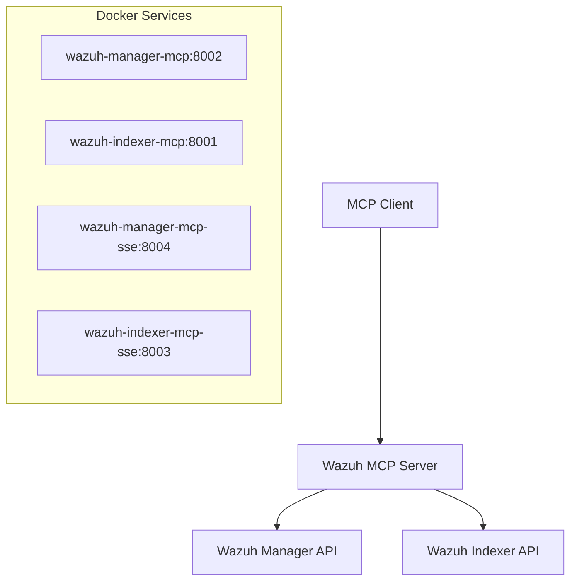

# Docker Deployment Guide

This guide covers containerized deployment of the Wazuh MCP Server using Docker and Docker Compose.

## 🐳 Overview

The Wazuh MCP Server supports multiple transport modes through Docker profiles:

- **HTTP Mode**: REST API endpoints for production use
- **SSE Mode**: Server-Sent Events for real-time streaming
- **STDIO Mode**: Standard I/O for MCP client integration

## 📋 Prerequisites

- Docker Engine 20.10+
- Docker Compose v2.0+
- Access to Wazuh Manager (port 55000)
- Access to Wazuh Indexer (port 9200)

## 🏗️ Architecture



## ⚙️ Configuration

### Environment Variables

Create `.env` file in `deployment/docker/`:

```env
# Wazuh Indexer Configuration
WAZUH_INDEXER_HOST=host.docker.internal
WAZUH_INDEXER_PORT=9200
WAZUH_INDEXER_USERNAME=admin
WAZUH_INDEXER_PASSWORD=admin
WAZUH_INDEXER_VERIFY_SSL=false

# Wazuh Manager Configuration
WAZUH_MANAGER_HOST=host.docker.internal
WAZUH_MANAGER_PORT=55000
WAZUH_MANAGER_USERNAME=wazuh
WAZUH_MANAGER_PASSWORD=wazuh
WAZUH_MANAGER_VERIFY_SSL=false

# MCP Server Configuration
WAZUH_INDEXER_MCP_PORT=8001
WAZUH_MANAGER_MCP_PORT=8002
```

### Network Configuration

The services use `host.docker.internal` to access host services. For production:

```env
WAZUH_INDEXER_HOST=your-indexer-hostname
WAZUH_MANAGER_HOST=your-manager-hostname
```

## 🚀 Deployment Options

### Option 1: HTTP Mode (Recommended for Production)

Start only HTTP API servers:

```bash
cd deployment/docker
docker compose --profile http up -d
```

Services started:
- `wazuh-indexer-mcp` (port 8001)
- `wazuh-manager-mcp` (port 8002)

### Option 2: SSE Mode (Real-time Events)

Start Server-Sent Events servers:

```bash
docker compose --profile sse up -d
```

Services started:
- `wazuh-indexer-mcp-sse` (port 8003)
- `wazuh-manager-mcp-sse` (port 8004)

### Option 3: STDIO Mode (MCP Clients)

Start STDIO servers for MCP client integration:

```bash
docker compose --profile stdio up --no-deps
```

Services started:
- `wazuh-indexer-mcp-stdio` (no exposed ports)
- `wazuh-manager-mcp-stdio` (no exposed ports)

### Option 4: Multi-Mode Deployment

Start all transport modes simultaneously:

```bash
docker compose --profile http --profile sse --profile stdio up -d
```

## 🔍 Service Details

### HTTP Mode Services

| Service | Container | Port | Health Check | Purpose |
|---------|-----------|------|--------------|---------|
| wazuh-indexer-mcp | wazuh-indexer-mcp | 8001 | `/health` | REST API |
| wazuh-manager-mcp | wazuh-manager-mcp | 8002 | `/health` | REST API |

### SSE Mode Services

| Service | Container | Port | Health Check | Purpose |
|---------|-----------|------|--------------|---------|
| wazuh-indexer-mcp-sse | wazuh-indexer-mcp-sse | 8003 | `/sse/` | Real-time events |
| wazuh-manager-mcp-sse | wazuh-manager-mcp-sse | 8004 | `/sse/` | Real-time events |

### STDIO Mode Services

| Service | Container | Port | Purpose |
|---------|-----------|------|---------|
| wazuh-indexer-mcp-stdio | wazuh-indexer-mcp-stdio | - | MCP client integration |
| wazuh-manager-mcp-stdio | wazuh-manager-mcp-stdio | - | MCP client integration |

## 📊 Monitoring and Health Checks

### Health Check Commands

```bash
# HTTP Mode
curl http://localhost:8001/health  # Indexer
curl http://localhost:8002/health  # Manager

# SSE Mode
curl http://localhost:8003/sse/    # Indexer SSE
curl http://localhost:8004/sse/    # Manager SSE
```

### Service Status

```bash
# Check running services
docker compose ps

# View service logs
docker compose logs wazuh-indexer-mcp
docker compose logs wazuh-manager-mcp

# Follow logs in real-time
docker compose logs -f
```

## 🔧 Management Commands

### Start Services

```bash
# Start specific profile
docker compose --profile http up -d

# Start in foreground (see logs)
docker compose --profile http up
```

### Stop Services

```bash
# Stop all services
docker compose down

# Stop specific service
docker compose stop wazuh-indexer-mcp
```

### Restart Services

```bash
# Restart all services
docker compose restart

# Restart specific service
docker compose restart wazuh-indexer-mcp
```

### Update Services

```bash
# Rebuild and restart
docker compose build
docker compose --profile http up -d
```

## 🔒 Security Considerations

### Network Security

- Services run in isolated `mcp-network`
- Only specified ports are exposed
- Use TLS/SSL in production environments

### Credentials Management

- Store sensitive data in `.env` file
- Use Docker secrets for production
- Rotate credentials regularly

### Resource Limits

Add resource limits in production:

```yaml
services:
  wazuh-indexer-mcp:
    deploy:
      resources:
        limits:
          memory: 512M
          cpus: '0.5'
```

## 🔄 Backup and Recovery

### Configuration Backup

```bash
# Backup configuration
cp .env .env.backup
cp docker-compose.yml docker-compose.yml.backup
```

### Data Persistence

Services are stateless, but logs can be persisted:

```yaml
volumes:
  - ./logs:/app/logs
```

## 🚨 Troubleshooting

### Common Issues

**Container fails to start:**
```bash
# Check logs
docker compose logs wazuh-indexer-mcp

# Check environment
docker compose config
```

**Health check fails:**
```bash
# Test manually
docker exec -it wazuh-indexer-mcp curl localhost:8001/health

# Check Wazuh connectivity
docker exec -it wazuh-indexer-mcp ping host.docker.internal
```

**Port conflicts:**
```bash
# Check port usage
netstat -tulpn | grep :8001

# Use different ports
WAZUH_INDEXER_MCP_PORT=8011 docker compose up
```

### Debug Mode

Enable debug logging:

```env
LOG_LEVEL=DEBUG
```

## 📈 Performance Tuning

### Resource Optimization

```yaml
services:
  wazuh-indexer-mcp:
    environment:
      - WORKERS=4
      - MAX_CONNECTIONS=100
    deploy:
      resources:
        limits:
          memory: 1G
          cpus: '1.0'
```

### Load Balancing

For high availability, use a load balancer:

```nginx
upstream wazuh_mcp {
    server localhost:8001;
    server localhost:8011;
}
```

## 🎯 Production Deployment

### Recommended Setup

```bash
# Production deployment
docker compose --profile http up -d

# Enable monitoring
docker compose --profile monitoring up -d

# Configure reverse proxy
# Setup SSL certificates
# Implement log rotation
```

### Environment-Specific Configs

Use different compose files for environments:

```bash
# Development
docker compose -f docker-compose.yml -f docker-compose.dev.yml up

# Production
docker compose -f docker-compose.yml -f docker-compose.prod.yml up
```

This completes the Docker deployment guide. For specific transport mode details, see [Transport Modes](./transport-modes.md).
